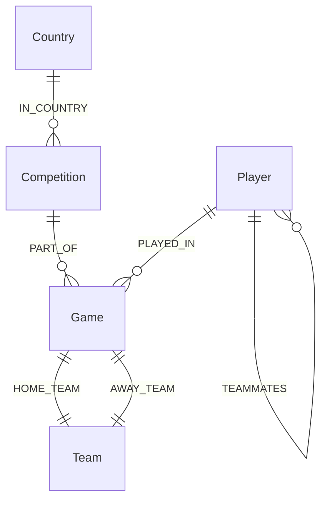

# Mermaid Graph Diagrams Guide

This document contains multiple Mermaid diagram formats for visualizing the Football Data Graph Database schema. Choose the one that best fits your needs.

## Available Diagrams

### 1. Graph_Schema.mmd - Entity Relationship Diagram (ERD)
**Best for:** Database documentation and formal schema representation



**Usage:** Copy the contents of `Graph_Schema.mmd` into any Mermaid-compatible viewer.

### 2. Graph_Schema_Visual.mmd - Visual Graph Diagram
**Best for:** Quick visual overview with color coding

Shows the graph structure with:
- Color-coded node types
- Clear relationship labels
- TEAMMATES relationship between Player nodes

**Usage:** Copy the contents of `Graph_Schema_Visual.mmd` into Mermaid Live Editor or GitHub.

### 3. Graph_Schema_Detailed.mmd - Detailed Flowchart
**Best for:** Understanding data flow and relationships

Organized into logical groups:
- Geographic Hierarchy (Country → Competition)
- Match Structure (Game → Teams)
- Player Participation (Players → Game)
- Player Relationships (TEAMMATES)

**Usage:** Copy the contents of `Graph_Schema_Detailed.mmd` into any Mermaid viewer.

### 4. Graph_Schema_Final.mmd - Complete Documentation Diagram
**Best for:** Project documentation and reports (PDF submission)

**Features:**
- All node properties listed
- All relationship properties listed
- Color-coded by node type
- Professional appearance suitable for reports

**Usage:** Copy the contents of `Graph_Schema_Final.mmd` into:
- Mermaid Live Editor: https://mermaid.live/
- GitHub/GitLab markdown files
- Documentation tools (Notion, Confluence, etc.)

## How to Render Mermaid Diagrams

### Option 1: Mermaid Live Editor (Recommended)
1. Go to https://mermaid.live/
2. Copy the contents of any `.mmd` file
3. Paste into the editor
4. Export as PNG/SVG for your PDF report

### Option 2: GitHub/GitLab
1. Create a markdown file (`.md`)
2. Add a code block with `mermaid` language:
   ````markdown
   ```mermaid
   [paste diagram code here]
   ```
   ````
3. View the rendered diagram on GitHub/GitLab

### Option 3: VS Code Extension
1. Install "Markdown Preview Mermaid Support" extension
2. Open any `.mmd` file
3. Use preview to see the rendered diagram

### Option 4: Online Tools
- **Mermaid.ink**: https://mermaid.ink/ (for direct image URLs)
- **Draw.io**: Supports Mermaid import

## Recommended for Project Submission

For your PDF report (`Project2_Part_Time.pdf` requirements), use **Graph_Schema_Final.mmd** because it:
- ✅ Shows all node properties
- ✅ Shows all relationship properties
- ✅ Clearly indicates TEAMMATES connects Player to Player (not Player to Team)
- ✅ Has professional styling suitable for academic submission
- ✅ Can be exported as high-quality PNG/SVG

## Key Schema Points Illustrated

All diagrams correctly show:
- ✅ `Country -[:IN_COUNTRY]-> Competition`
- ✅ `Competition -[:PART_OF]-> Game`
- ✅ `Game -[:HOME_TEAM]-> Team`
- ✅ `Game -[:AWAY_TEAM]-> Team`
- ✅ `Player -[:PLAYED_IN]-> Game` (with performance properties)
- ✅ `Player -[:TEAMMATES]-> Player` (with gamesTogether property)

**Important:** The TEAMMATES relationship connects two Player nodes, not Player to Team. This is correctly shown in all diagrams.

## Example Usage in Markdown

To include in your report, you can embed it like this:

````markdown
## Graph Schema Diagram

```mermaid
[paste Graph_Schema_Final.mmd contents here]
```

### Description
The graph consists of five node types: Country, Competition, Game, Team, and Player...
````

